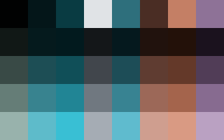
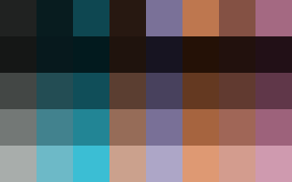
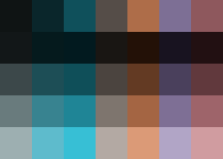

# Okolors [](https://crates.io/crates/okolors)

Okolors takes an image and produces a color palette consisting of the image's average colors.
It does this by converting the image's pixels to the [Oklab](https://bottosson.github.io/posts/oklab/) color space
and then performing [k-means clustering](https://en.wikipedia.org/wiki/K-means_clustering).
By using a proper color space for color difference and a more accurate clustering algorithm,
this helps to ensure that the generated palette is truly representative of the input image.

One of the main intended use cases for Okolors is to generate colors for a theme based off a wallpaper.
In line with this goal, the Okolors binary also supports printing the final average colors in multiple Okhsl lightness levels.
For example, you can specify a low lightness level for background colors
and a high lightness for foreground text in order to achieve a certain contrast ratio.
The [Okhsl](https://bottosson.github.io/posts/colorpicker/) color space is ideal for this,
because as the lightness is changed, Okhsl preserves the hue and saturation of the color
(better than other color spaces like HSL).

The Okolors binary supports jpeg, png, gif, and qoi images by default.
See the [features](#features) section for more info.
Precompiled binaries are available on [Github](https://github.com/Ivordir/Okolors/releases).

For more specific information regarding the `okolors` library
see the [docs.rs](https://docs.rs/okolors/latest/okolors/) page as well.

# Examples

Let's use the following photo for the examples below.


Running Okolors for this image with the default options gives the following sRGB hex values.

```bash
> okolors 'img/Jewel Changi.jpg'
020606 08373E E2E4E7 4F8091 4E2F26 CA835A 926F97 BB7B7B
```

If your terminal supports true color,
then you can use `-o swatch` to see blocks of the output colors.

```bash
> okolors 'img/Jewel Changi.jpg' -o swatch
```


We can increase the color accuracy by increasing the number of trials, `-n`, and lowering the convergence threshold, `-e`.

```bash
> okolors 'img/Jewel Changi.jpg' -n 3 -e 0.01 -o swatch
```


Let's get these colors in additional lightness levels using `-l`.

```bash
> okolors 'img/Jewel Changi.jpg' -l 10,30,50,70 -n 3 -e 0.01 -o swatch
```



If we're providing our own lightness levels, maybe we want to cluster the colors by hue and saturation only.
Let's set the lightness weight to `0.01` using `-w`.

```bash
> okolors 'img/Jewel Changi.jpg' -w 0.01 -l 10,30,50,70 -n 3 -e 0.01 -o swatch
```



That ended up bringing out an additional pinkish color but also merged white and black into a gray.
So, use this at your own discretion!

If some of the colors still seem quite similar, then you can reduce/set the number of colors through `-k`.

```bash
> okolors 'img/Jewel Changi.jpg' -k 7 -w 0.01 -l 10,30,50,70 -n 3 -e 0.01 -o swatch
```



To see all the other command line options, pass `-h` for a summary or `--help` for detailed explanations.
Note that the CLI flags translate one-to-one with the library parameters, if there is an equivalent.

# Performance

Despite using k-means which is more accurate but slower than something like median cut quantization,
Okolors still seems to be pretty fast. Excluding the time to read and decode the image from disk,
below are Okolors's running times for each image as reported by [criteron](https://github.com/bheisler/criterion.rs).
The parameters used were `k = 8`, `convergence_threshold = 0.05`, `trials = 1`, `max_iter = 1024`, and `lightness_weight = 0.325`.
The benchmarks were run on a 4-core/8-thread CPU, so YMMV on different hardware (especially with more or less cores).

| Image                    | Dimensions | Time (ms) |
|:------------------------ |:----------:| ---------:|
| Akihabara.jpg            | 5663x3669  |       353 |
| Bryggen.jpg              | 5508x3098  |        88 |
| Cesky Krumlov.jpg        | 4608x3456  |       170 |
| Hokkaido.jpg             | 6000x4000  |       180 |
| Jewel Changi.jpg         | 6000x4000  |       124 |
| Lake Atitlan.jpg         | 5112x3408  |       301 |
| Lake Mendota.jpg         | 3839x5758  |       124 |
| Louvre.jpg               | 6056x4000  |       177 |
| Sydney Sunset.jpg        | 2880x1508  |        22 |
| Termas Geometricas.jpg   | 5472x3648  |       168 |
| Yellow Crane Tower.jpg   | 3785x2839  |       119 |
| Yosemite Tunnel View.jpg | 5580x3720  |       172 |

Note that these are high resolution images, so the running time can be much faster for lower resolution images.
The binary also has a CLI flag to create a thumbnail for images over a certain size.

# Features

## Library

- `threads`: enabled by default and toggles parallelism via [rayon](https://github.com/rayon-rs/rayon).

## Binary

- `threads`: enabled by default and toggles the corresponding library feature.

- `jpeg`, `png`, `gif`, and `qoi`: support for these image formats is enabled by default.

- `jpeg_rayon`: enabled by default, allows multiple threads for decoding jpeg images.

- `webp`: WebP support is not enabled by default, as it seems that the `image` crate still has lingering bugs for WebP in certain cases:
[1](https://github.com/image-rs/image/issues/1873),
[2](https://github.com/image-rs/image/issues/1872),
[3](https://github.com/image-rs/image/issues/1712),
[4](https://github.com/image-rs/image/issues/1647).
Panics and bugs resulting from this should be directed upstream.

- `avif`: similarly, due an [issue](https://github.com/image-rs/image/issues/1647) with AVIF support in the `image` crate,
this feature is not enabled by default and instead uses the `libavif-image` crate.
Compiling with this feature requires cmake and nasm on the system.

- `bmp` and `tiff`: support for these image formats is not enabled by default.

# References

- [kmeans-colors](https://github.com/okaneco/kmeans-colors/) served as the basis for Okolors.
  If you want to perform other k-means related operations on images or prefer the CIELAB colorspace, then check it out!
- The work by [Dr. Greg Hamerly and others](https://cs.baylor.edu/~hamerly/software/kmeans)
  was a very helpful resource for the k-means implementation in Okolors.
- The awesome [palette](https://github.com/Ogeon/palette) library is used for all color conversions.
