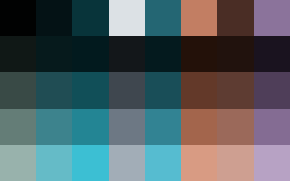
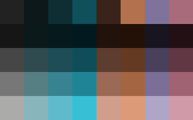
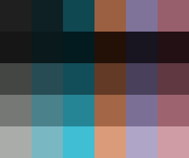
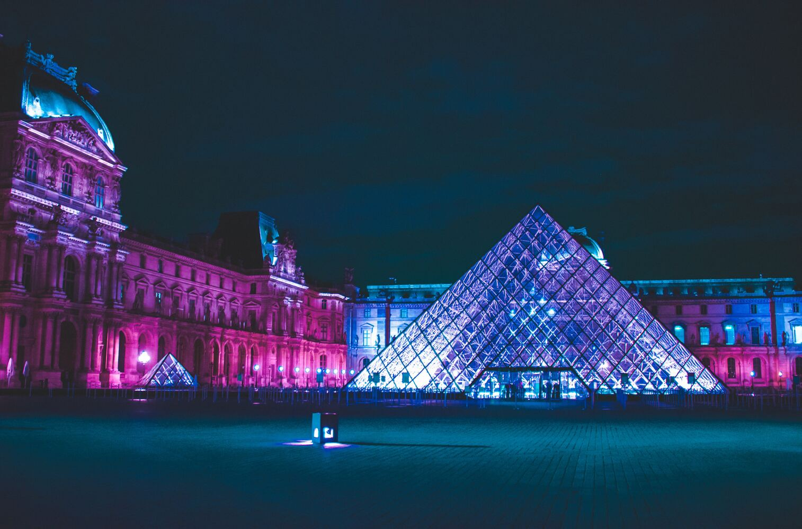
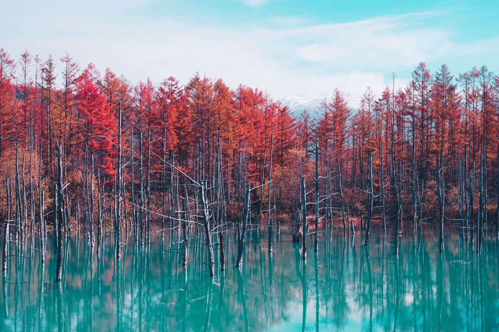

# Okolors

Okolors generates high quality color palettes from an image for your theming needs.
It does this by converting the image's pixels to the
[Oklab](https://bottosson.github.io/posts/oklab/) color space
and then performing [k-means](https://en.wikipedia.org/wiki/K-means_clustering) clustering.
By using a proper color space for color difference and a more accurate clustering algorithm,
this helps to ensure that the generated palette is truly representative of the input image.

One of the main intended use cases for Okolors is to generate colors for a theme based off a wallpaper.
In line with this goal, the Okolors also supports printing the final average colors in multiple Okhsl lightness levels.
For example, you can specify a low lightness level for background colors
and a high lightness for foreground text in order to achieve a certain contrast ratio.
The [Okhsl](https://bottosson.github.io/posts/colorpicker/) color space is ideal for this,
because as the lightness is changed, Okhsl preserves the hue and saturation of the color
(better than other color spaces like HSL).

Okolors supports jpeg, png, gif, and qoi images by default.
See the [features](#features) section for more info.
Precompiled binaries are available on [Github](https://github.com/Ivordir/Okolors/releases).

If you are looking for the Okolors library, see the crates.io page or the documentation:

[](https://crates.io/crates/okolors)
[](https://docs.rs/okolors)

# Examples

## CLI Flags

Let's use the following photo for the examples below.


Running Okolors for this image with the default options gives the following sRGB hex values.

```bash
> okolors 'Jewel Changi.jpg'
010202 041215 08343A DCE1E5 246673 C27E63 4A2D25 8B739B
```

If your terminal supports true color,
then you can use `-o swatch` to see blocks of the output colors.

```bash
> okolors 'Jewel Changi.jpg' -o swatch
```


Let's get these colors in additional lightness levels using `-l`.

```bash
> okolors 'Jewel Changi.jpg' -l 10,30,50,70 -o swatch
```



If we're providing our own lightness levels, maybe we want to cluster the colors by hue and saturation only.
Let's set the lightness weight to `0` using `-w`.

```bash
> okolors 'Jewel Changi.jpg' -w 0 -l 10,30,50,70 -o swatch
```



That ended up bringing out an additional pinkish color but also merged white and black into a gray.
So, use this at your own discretion!

If some of the colors still seem quite similar, then you can reduce/set the number of colors through `-k`.

```bash
> okolors 'Jewel Changi.jpg' -k 6 -w 0 -l 10,30,50,70 -o swatch
```



To see all the other command line options, pass `-h` for a summary or `--help` for detailed explanations.

## Images

Here are some more examples of Okolors in action. The only CLI flag used was `-s l`.

### Louvre



### Hokkaido



### Český Krumlov


### Lake Mendota


# Performance

Okolors is designed with performance in mind and should give fast results for even very large images.
This is despite using k-means which is more accurate but slower than something like median cut quantization. Below are the palette generation times as reported by the `--verbose` flag.
The only other flag used was `-t 4` to use 4 threads.

| Image               | Width | Height | Unique Colors | Time (ms) |
| ------------------- | -----:| ------:| -------------:| ---------:|
| Louvre              | 6056  | 4000   | 616101        | 63        |
| Hokkaido            | 6000  | 4000   | 576339        | 57        |
| Jewel Changi        | 6000  | 4000   | 400788        | 48        |
| Český Krumlov       | 4608  | 3456   | 743552        | 51        |
| Lake Mendota        | 3839  | 5758   | 467802        | 55        |
| Louvre (25%)        | 1514  | 1000   | 238332        | 18        |
| Hokkaido (25%)      | 1500  | 1000   | 262207        | 18        |
| Jewel Changi (25%)  | 1500  | 1000   | 147678        | 11        |
| Český Krumlov (25%) | 1152  | 864    | 294989        | 20        |
| Lake Mendota (25%)  | 960   | 1440   | 264149        | 18        |

Oftentimes, especially for large images, loading the image from disk takes longer
than it does for Okolors to generate the palette!

# Features

Here is the list of cargo features and supported image foramts:

- `threads`: use multiple threads to generate palettes (enabled by default).

- `jpeg`, `png`, `gif`, and `qoi`: support for these image formats is enabled by default through the `default_formats` feature.

- `webp`: WebP support is not enabled by default, as it seems that the `image` crate still has lingering bugs for WebP in certain cases:
[1](https://github.com/image-rs/image/issues/1873),
[2](https://github.com/image-rs/image/issues/1872),
[3](https://github.com/image-rs/image/issues/1712),
[4](https://github.com/image-rs/image/issues/1647).
Panics and bugs resulting from this should be directed upstream.

- `avif`: similarly, due an [issue](https://github.com/image-rs/image/issues/1647) with AVIF support in the `image` crate,
this feature is not enabled by default and instead uses the `libavif-image` crate.
Compiling with this feature requires cmake and nasm on the system.

- `bmp` and `tiff`: support for these image formats is not enabled by default.

# References

- [kmeans-colors](https://github.com/okaneco/kmeans-colors/) served as the original inspiration for Okolors.
  If you want to perform other k-means related operations on images or prefer the CIELAB colorspace, then check it out!
- The awesome [palette](https://github.com/Ogeon/palette) library is used for all color conversions.

# License

Okolors (binary and library) is licensed under either
- the [Apache License, Version 2.0](https://www.apache.org/licenses/LICENSE-2.0) (see [LICENSE-APACHE](LICENSE-APACHE))
- the [MIT](http://opensource.org/licenses/MIT) license (see [LICENSE-MIT](LICENSE-MIT))

at your option.
