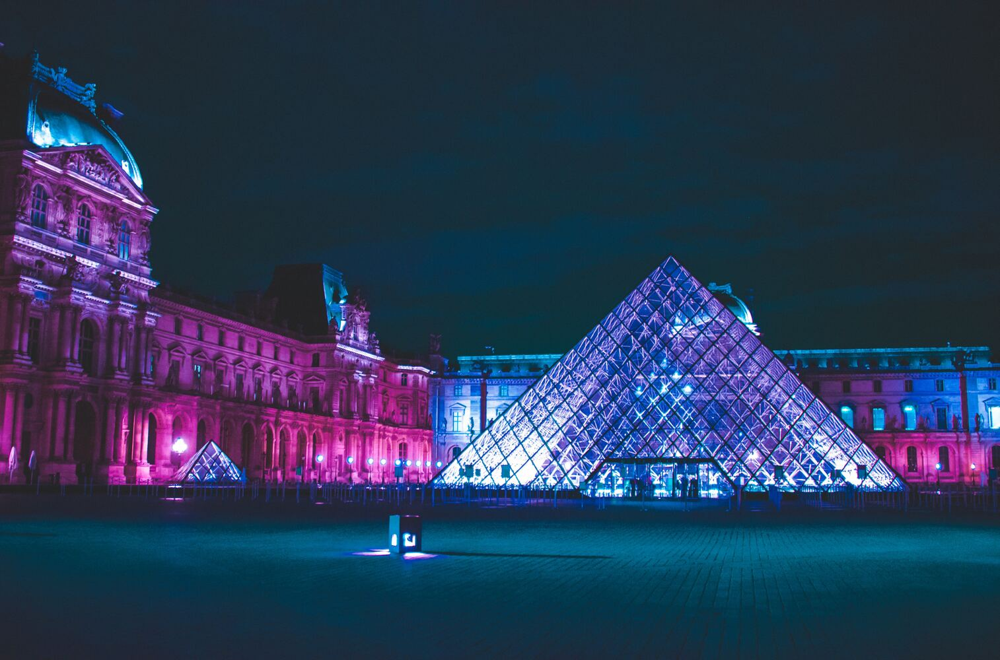
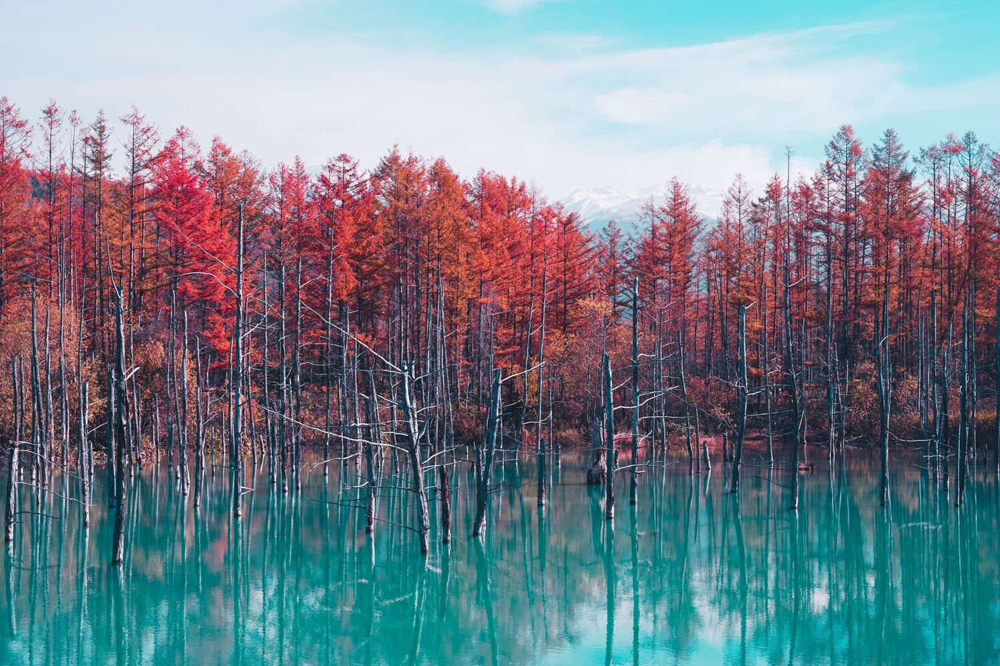

# Okolors

Okolors generates high quality color palettes from an image for your theming needs.
It does this by converting the image's pixels to the
[Oklab](https://bottosson.github.io/posts/oklab/) color space
and then performing [k-means](https://en.wikipedia.org/wiki/K-means_clustering) clustering.
By using a proper color space for color difference and a more accurate clustering algorithm,
this helps to ensure that the generated palette is truly representative of the input image.

If you are looking for the CLI application,
see the [Github](https://github.com/Ivordir/Okolors) page.

# Examples

Here are some examples of palettes generated by Okolors (using the default options).

## Louvre

## Hokkaido

## Jewel Changi

## Český Krumlov

## Lake Mendota

# Performance

Okolors is designed with performance in mind and should give fast results for even very large images.
Below are the palette generation times as reported by the CLI application via the `--verbose` flag.
4 threads and the default options were used.

| Image               | Width | Height | Unique Colors | Time (ms) |
| ------------------- | -----:| ------:| -------------:| ---------:|
| Louvre              | 6056  | 4000   | 616101        | 63        |
| Hokkaido            | 6000  | 4000   | 576339        | 57        |
| Jewel Changi        | 6000  | 4000   | 400788        | 48        |
| Český Krumlov       | 4608  | 3456   | 743552        | 51        |
| Lake Mendota        | 3839  | 5758   | 467802        | 55        |
| Louvre (25%)        | 1514  | 1000   | 238332        | 18        |
| Hokkaido (25%)      | 1500  | 1000   | 262207        | 18        |
| Jewel Changi (25%)  | 1500  | 1000   | 147678        | 11        |
| Český Krumlov (25%) | 1152  | 864    | 294989        | 20        |
| Lake Mendota (25%)  | 960   | 1440   | 264149        | 18        |

# License

Okolors is licensed under either
- the [Apache License, Version 2.0](https://www.apache.org/licenses/LICENSE-2.0) (see [LICENSE-APACHE](LICENSE-APACHE))
- the [MIT](http://opensource.org/licenses/MIT) license (see [LICENSE-MIT](LICENSE-MIT))

at your option.
