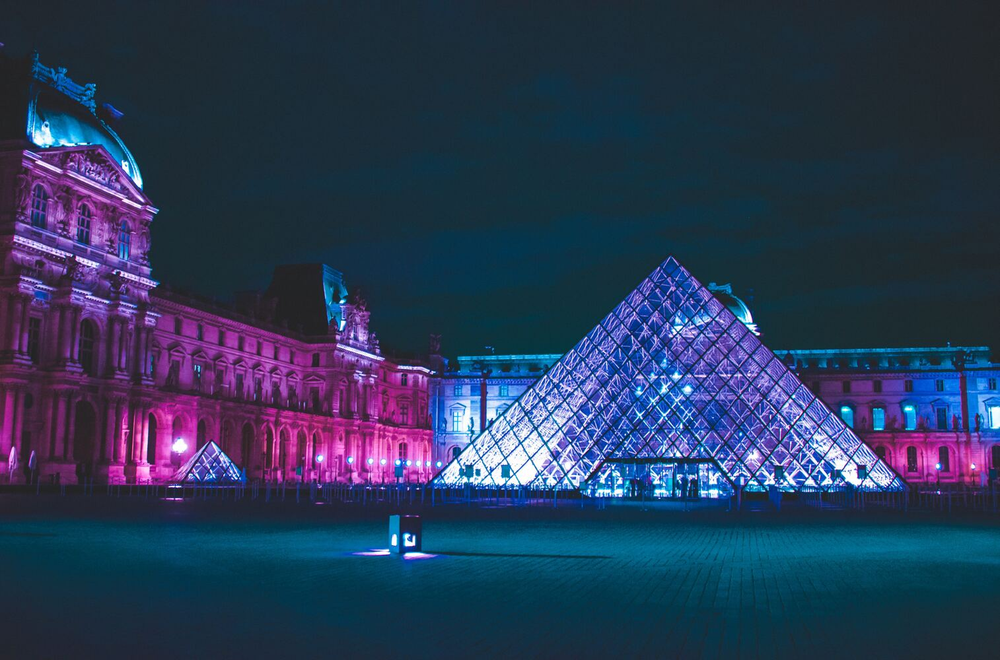
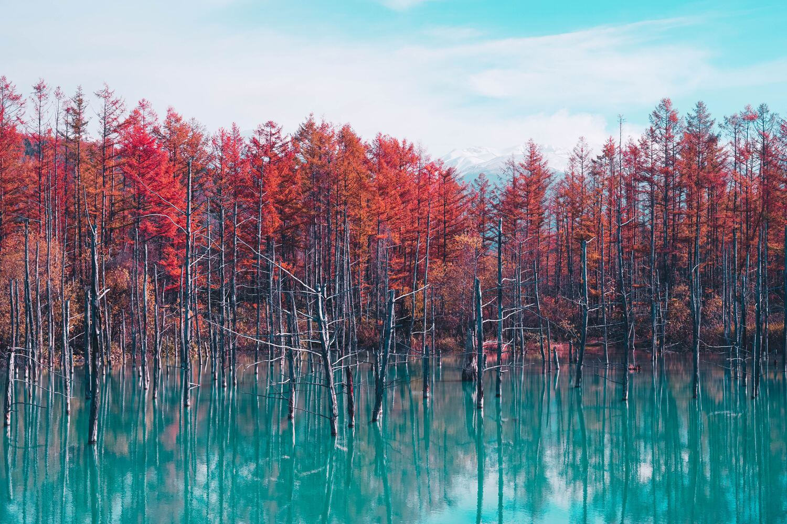

# Okolors

Okolors generates high quality color palettes from an image for your theming needs. It does this by converting the image's pixels to the [Oklab](https://bottosson.github.io/posts/oklab/) color space and then performing [k-means](https://en.wikipedia.org/wiki/K-means_clustering) clustering. By using a proper color space for color difference and a more accurate clustering algorithm, this helps to ensure that the generated palette is truly representative of the input image.

If you are looking for the CLI application, see the [Github](https://github.com/IanManske/Okolors) page.

# Examples

Here are some examples of palettes generated by Okolors (using the default options).

## Louvre

## Hokkaido

## Jewel Changi

## Český Krumlov

## Lake Mendota

# Performance

Okolors is designed with performance in mind and should give fast results for even very large images. This is despite using k-means which is more accurate but slower than something like median cut quantization. Below are the palette generation times as reported by the CLI application with the `--verbose` flag. The only other flag used was `-t 4` to use 4 threads. The default/empty `RUSTFLAGS` were specified.

| Image               | Width | Height | Time (ms) |
| ------------------- | -----:| ------:| ---------:|
| Louvre              | 6056  | 4000   | 59        |
| Hokkaido            | 6000  | 4000   | 57        |
| Jewel Changi        | 6000  | 4000   | 61        |
| Český Krumlov       | 4608  | 3456   | 41        |
| Lake Mendota        | 3839  | 5758   | 53        |

Consider enabling the `avx` or `avx2` target features for a noticeable speedup, since the underlying quantization library ([`quantette`](https://github.com/IanManske/quantette)) utilizes SIMD. For more extensive benchmarks, see the README for `quantette`.

# License

Okolors is licensed under either
- the [Apache License, Version 2.0](https://www.apache.org/licenses/LICENSE-2.0) (see [LICENSE-APACHE](../LICENSE-APACHE))
- the [MIT](http://opensource.org/licenses/MIT) license (see [LICENSE-MIT](../LICENSE-MIT))

at your option.
